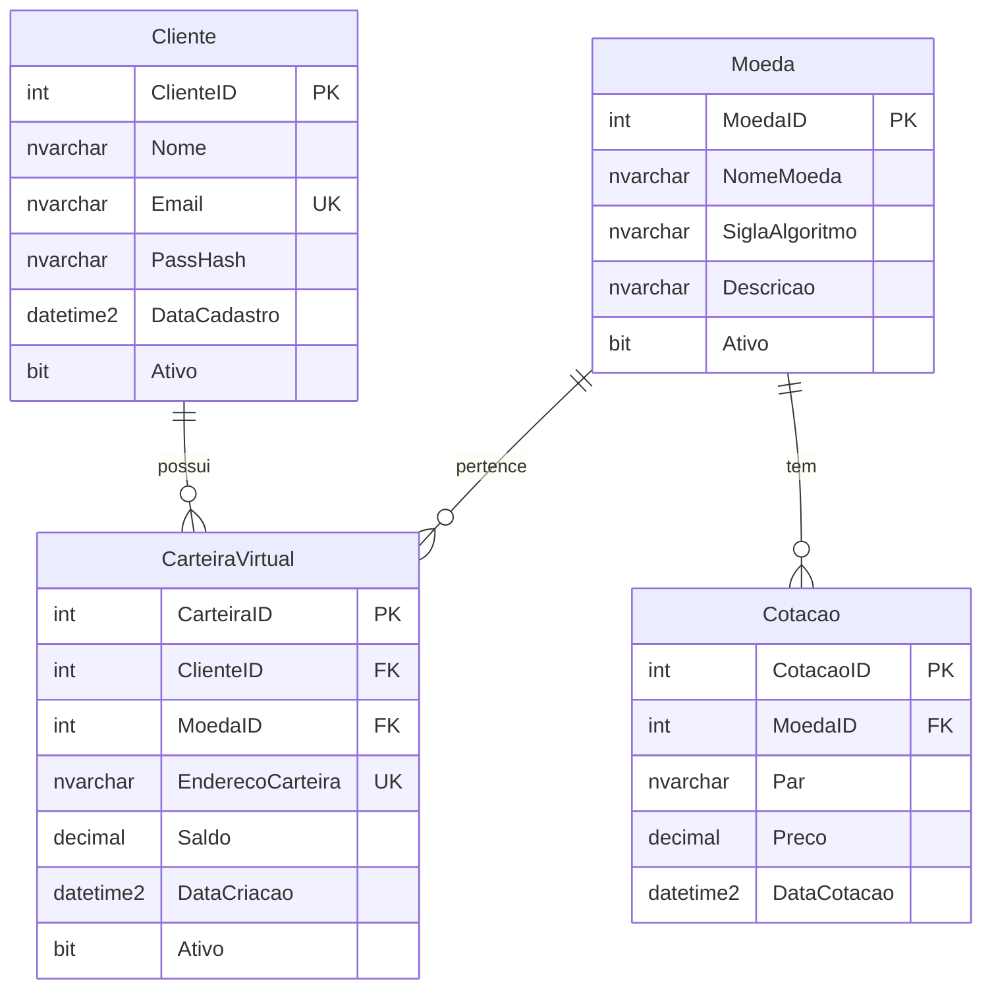

# Documentação Técnica - Sistema de Carteira Virtual de Criptomoedas

## 📋 Índice

1. [Visão Geral](#visão-geral)
2. [Arquitetura do Sistema](#arquitetura-do-sistema)
3. [Modelo de Dados](#modelo-de-dados)
4. [Especificações Técnicas](#especificações-técnicas)
5. [Scripts de Implementação](#scripts-de-implementação)
6. [Índices e Otimizações](#índices-e-otimizações)
7. [Visões e Relatórios](#visões-e-relatórios)
8. [Procedimentos de Backup/Restore](#procedimentos-de-backuprestore)
9. [Testes e Validação](#testes-e-validação)
10. [Troubleshooting](#troubleshooting)

---

## 🎯 Visão Geral

### Objetivo
Desenvolver um sistema de banco de dados robusto e escalável para gerenciamento de carteiras virtuais de criptomoedas, atendendo aos requisitos da disciplina **Programação em Banco de Dados** da **Universidade Tuiuti do Paraná**.

### Escopo Funcional
- **Gestão de Usuários:** Cadastro, autenticação e controle de acesso
- **Gestão de Moedas:** Registro e manutenção de criptomoedas
- **Gestão de Cotações:** Controle de preços históricos e atuais
- **Gestão de Carteiras:** Administração de saldos e endereços blockchain

### Tecnologias Utilizadas
- **SGBD:** Microsoft SQL Server 2016+
- **Linguagem:** T-SQL (Transact-SQL)
- **Ferramentas:** SQL Server Management Studio (SSMS)
- **Padrões:** Base58 para endereços, MD5 para hashing

---

## 🏗️ Arquitetura do Sistema

### Estrutura do Banco de Dados

```
CarteiraVirtualDB
└── Schema: Wallet
    ├── Tables
    │   ├── Cliente
    │   ├── Moeda  
    │   ├── Cotacao
    │   └── CarteiraVirtual
    ├── Views
    │   └── VW_SaldoUsuario
    └── Indexes
        ├── IX_Cliente_Email
        ├── IX_Cotacao_MoedaID_DataCotacao
        ├── IX_CarteiraVirtual_ClienteID
        ├── IX_CarteiraVirtual_MoedaID
        └── IX_CarteiraVirtual_EnderecoCarteira
```

### Relacionamentos



---

## 💾 Modelo de Dados

### Tabela: Wallet.Cliente

| Campo | Tipo | Restrições | Descrição |
|-------|------|------------|-----------|
| `ClienteID` | `INT IDENTITY(1,1)` | `PRIMARY KEY` | Identificador único do cliente |
| `Nome` | `NVARCHAR(100)` | `NOT NULL` | Nome completo do usuário |
| `Email` | `NVARCHAR(100)` | `NOT NULL UNIQUE` | Email único para login |
| `PassHash` | `NVARCHAR(32)` | `NOT NULL` | Hash MD5 da senha |
| `DataCadastro` | `DATETIME2` | `DEFAULT SYSDATETIME()` | Timestamp de criação |
| `Ativo` | `BIT` | `DEFAULT 1` | Flag de ativação da conta |

**Exemplos de Hash MD5:**
- Senha: `123456` → Hash: `e10adc3949ba59abbe56e057f20f883e`
- Senha: `senha123` → Hash: `482c811da5d5b4bc6d497ffa98491e38`

### Tabela: Wallet.Moeda

| Campo | Tipo | Restrições | Descrição |
|-------|------|------------|-----------|
| `MoedaID` | `INT IDENTITY(1,1)` | `PRIMARY KEY` | Identificador único da moeda |
| `NomeMoeda` | `NVARCHAR(50)` | `NOT NULL` | Nome completo da criptomoeda |
| `SiglaAlgoritmo` | `NVARCHAR(10)` | `NOT NULL` | Sigla/símbolo (ex: BTC, ETH) |
| `Descricao` | `NVARCHAR(200)` | `NULL` | Descrição técnica da moeda |
| `Ativo` | `BIT` | `DEFAULT 1` | Flag de moeda ativa no sistema |

### Tabela: Wallet.Cotacao

| Campo | Tipo | Restrições | Descrição |
|-------|------|------------|-----------|
| `CotacaoID` | `INT IDENTITY(1,1)` | `PRIMARY KEY` | Identificador único da cotação |
| `MoedaID` | `INT` | `NOT NULL, FK` | Referência à moeda |
| `Par` | `NVARCHAR(10)` | `NOT NULL` | Par de negociação (ex: BTC/USD) |
| `Preco` | `DECIMAL(18,8)` | `NOT NULL` | Preço com 8 casas decimais |
| `DataCotacao` | `DATETIME2` | `DEFAULT SYSDATETIME()` | Timestamp da cotação |

**Precisão Decimal:** 
- Formato: `DECIMAL(18,8)`
- Máximo: 9,999,999,999.99999999
- Ideal para criptomoedas com alta precisão

### Tabela: Wallet.CarteiraVirtual

| Campo | Tipo | Restrições | Descrição |
|-------|------|------------|-----------|
| `CarteiraID` | `INT IDENTITY(1,1)` | `PRIMARY KEY` | Identificador único da carteira |
| `ClienteID` | `INT` | `NOT NULL, FK` | Referência ao cliente proprietário |
| `MoedaID` | `INT` | `NOT NULL, FK` | Referência ao tipo de moeda |
| `EnderecoCarteira` | `NVARCHAR(100)` | `NOT NULL` | Endereço Base58 da blockchain |
| `Saldo` | `DECIMAL(18,8)` | `DEFAULT 0.00000000` | Saldo atual da carteira |
| `DataCriacao` | `DATETIME2` | `DEFAULT SYSDATETIME()` | Timestamp de criação |
| `Ativo` | `BIT` | `DEFAULT 1` | Flag de carteira ativa |

**Restrições de Negócio:**
- `UNIQUE (ClienteID, MoedaID)`: Um cliente pode ter apenas uma carteira por tipo de moeda
- Endereços seguem padrão Base58 das blockchains

---

## ⚙️ Especificações Técnicas

### Tipos de Dados Estratégicos

1. **NVARCHAR** para suporte completo a Unicode
2. **DECIMAL(18,8)** para precisão monetária em criptomoedas  
3. **DATETIME2** para timestamps de alta precisão
4. **BIT** para flags booleanas eficientes

### Funções SQL Utilizadas

```sql
-- Hash MD5 para senhas
CONVERT(NVARCHAR(32), HASHBYTES('MD5', 'senha'), 2)

-- Timestamp atual
SYSDATETIME()

-- Operações de data
DATEADD(DAY, -1, SYSDATETIME())
```

### Padrões de Nomenclatura

- **Tabelas:** PascalCase (`Cliente`, `CarteiraVirtual`)
- **Colunas:** PascalCase (`ClienteID`, `DataCadastro`)
- **Índices:** Prefixo `IX_` + Tabela + Coluna(s)
- **Esquema:** `Wallet` para organização lógica
- **Visões:** Prefixo `VW_` + Descrição

---

## 📊 Índices e Otimizações

### Estratégia de Indexação

```sql
-- Email para autenticação rápida
CREATE INDEX IX_Cliente_Email ON Wallet.Cliente(Email);

-- Cotações ordenadas por data (mais recente primeiro)
CREATE INDEX IX_Cotacao_MoedaID_DataCotacao ON Wallet.Cotacao(MoedaID, DataCotacao DESC);

-- Busca de carteiras por cliente
CREATE INDEX IX_CarteiraVirtual_ClienteID ON Wallet.CarteiraVirtual(ClienteID);

-- Busca de carteiras por moeda
CREATE INDEX IX_CarteiraVirtual_MoedaID ON Wallet.CarteiraVirtual(MoedaID);

-- Busca por endereço de carteira
CREATE INDEX IX_CarteiraVirtual_EnderecoCarteira ON Wallet.CarteiraVirtual(EnderecoCarteira);
```

### Análise de Performance

| Operação | Sem Índice | Com Índice | Melhoria |
|----------|------------|------------|----------|
| Login por Email | Table Scan | Index Seek | 95%+ |
| Cotação Atual | Table Scan | Index Seek | 90%+ |
| Saldo do Cliente | Nested Loops | Index Joins | 80%+ |

---

## 🔍 Visões e Relatórios

### Visão Principal: VW_SaldoUsuario

```sql
CREATE VIEW Wallet.VW_SaldoUsuario AS
SELECT 
    c.ClienteID,
    c.Nome AS NomeCliente,
    c.Email,
    m.NomeMoeda,
    m.SiglaAlgoritmo,
    cv.EnderecoCarteira,
    cv.Saldo,
    cot.Preco AS UltimaCotacao,
    (cv.Saldo * cot.Preco) AS ValorEmUSD,
    cv.DataCriacao AS DataCriacaoCarteira
FROM Wallet.Cliente c
INNER JOIN Wallet.CarteiraVirtual cv ON c.ClienteID = cv.ClienteID
INNER JOIN Wallet.Moeda m ON cv.MoedaID = m.MoedaID
OUTER APPLY (
    SELECT TOP 1 Preco 
    FROM Wallet.Cotacao cot 
    WHERE cot.MoedaID = m.MoedaID 
    ORDER BY DataCotacao DESC
) cot
WHERE c.Ativo = 1 AND cv.Ativo = 1 AND m.Ativo = 1;
```

**Funcionalidades da Visão:**
- Consolida dados de 4 tabelas
- Calcula valor em USD automaticamente
- Usa `OUTER APPLY` para cotação mais recente
- Filtra apenas registros ativos

### Relatórios Disponíveis

1. **Saldo por Usuário**
   ```sql
   SELECT * FROM Wallet.VW_SaldoUsuario 
   ORDER BY NomeCliente, NomeMoeda;
   ```

2. **Resumo Financeiro por Cliente**
   ```sql
   SELECT 
       NomeCliente,
       COUNT(*) AS QtdCarteiras,
       SUM(ValorEmUSD) AS ValorTotalUSD
   FROM Wallet.VW_SaldoUsuario
   GROUP BY ClienteID, NomeCliente
   ORDER BY ValorTotalUSD DESC;
   ```

3. **Histórico de Cotações**
   ```sql
   SELECT 
       m.NomeMoeda,
       c.Par,
       c.Preco,
       c.DataCotacao
   FROM Wallet.Cotacao c
   INNER JOIN Wallet.Moeda m ON c.MoedaID = m.MoedaID
   ORDER BY m.NomeMoeda, c.DataCotacao DESC;
   ```

---

## 💿 Procedimentos de Backup/Restore

### Script de Backup

```sql
-- Backup completo
BACKUP DATABASE CarteiraVirtualDB 
TO DISK = 'C:\Backup\CarteiraVirtualDB_Full.bak'
WITH FORMAT, INIT, 
     NAME = 'CarteiraVirtualDB-Full Database Backup',
     COMPRESSION;

-- Backup diferencial  
BACKUP DATABASE CarteiraVirtualDB 
TO DISK = 'C:\Backup\CarteiraVirtualDB_Diff.bak'
WITH DIFFERENTIAL, 
     NAME = 'CarteiraVirtualDB-Differential Database Backup',
     COMPRESSION;
```

### Script de Restore

```sql
-- Restore completo
RESTORE DATABASE CarteiraVirtualDB 
FROM DISK = 'C:\Backup\CarteiraVirtualDB_Full.bak'
WITH REPLACE, NORECOVERY;

-- Restore diferencial
RESTORE DATABASE CarteiraVirtualDB 
FROM DISK = 'C:\Backup\CarteiraVirtualDB_Diff.bak'
WITH RECOVERY;
```

---

## 🧪 Testes e Validação

### Testes de Integridade

```sql
-- Verificar integridade referencial
DBCC CHECKDB('CarteiraVirtualDB') WITH NO_INFOMSGS;

-- Verificar constraints
SELECT 
    TABLE_NAME,
    CONSTRAINT_NAME,
    CONSTRAINT_TYPE
FROM INFORMATION_SCHEMA.TABLE_CONSTRAINTS
WHERE TABLE_SCHEMA = 'Wallet';

-- Verificar índices
SELECT 
    i.name AS IndexName,
    t.name AS TableName,
    i.type_desc AS IndexType
FROM sys.indexes i
INNER JOIN sys.tables t ON i.object_id = t.object_id
INNER JOIN sys.schemas s ON t.schema_id = s.schema_id
WHERE s.name = 'Wallet';
```

### Testes de Performance

```sql
-- Tempo de resposta da visão principal
SET STATISTICS TIME ON;
SELECT COUNT(*) FROM Wallet.VW_SaldoUsuario;
SET STATISTICS TIME OFF;

-- Análise do plano de execução
SET SHOWPLAN_ALL ON;
SELECT * FROM Wallet.VW_SaldoUsuario WHERE NomeCliente = 'João Silva';
SET SHOWPLAN_ALL OFF;
```

### Validação de Dados

```sql
-- Verificar dados inconsistentes
SELECT 'Clientes sem carteira' AS Problema, COUNT(*) AS Quantidade
FROM Wallet.Cliente c
LEFT JOIN Wallet.CarteiraVirtual cv ON c.ClienteID = cv.ClienteID
WHERE cv.ClienteID IS NULL AND c.Ativo = 1

UNION ALL

SELECT 'Moedas sem cotação', COUNT(*)
FROM Wallet.Moeda m
LEFT JOIN Wallet.Cotacao cot ON m.MoedaID = cot.MoedaID
WHERE cot.MoedaID IS NULL AND m.Ativo = 1;
```

---

## 🔧 Troubleshooting

### Problemas Comuns

#### 1. Erro: "CREATE VIEW must be the first statement"
**Causa:** View não isolada em batch próprio  
**Solução:** Adicionar `GO` antes e depois do `CREATE VIEW`

#### 2. Erro: "Invalid object name 'Wallet.Cliente'"
**Causa:** Esquema não criado ou conexão em banco errado  
**Solução:** Verificar `USE CarteiraVirtualDB` e criação do schema

#### 3. Erro: "Violation of UNIQUE KEY constraint"
**Causa:** Tentativa de inserir email duplicado  
**Solução:** Verificar unicidade dos emails antes da inserção

```sql
-- Verificar emails duplicados
SELECT Email, COUNT(*) 
FROM Wallet.Cliente 
GROUP BY Email 
HAVING COUNT(*) > 1;
```

#### 4. Performance lenta nas consultas
**Causa:** Índices ausentes ou fragmentados  
**Solução:** Reorganizar/reconstruir índices

```sql
-- Verificar fragmentação
SELECT 
    i.name AS IndexName,
    ps.avg_fragmentation_in_percent
FROM sys.dm_db_index_physical_stats(DB_ID(), NULL, NULL, NULL, NULL) ps
INNER JOIN sys.indexes i ON ps.object_id = i.object_id 
                         AND ps.index_id = i.index_id
WHERE ps.avg_fragmentation_in_percent > 10;

-- Reconstruir índice fragmentado
ALTER INDEX IX_CarteiraVirtual_ClienteID ON Wallet.CarteiraVirtual REBUILD;
```

### Comandos de Diagnóstico

```sql
-- Verificar conexões ativas
SELECT 
    session_id,
    login_name,
    host_name,
    program_name,
    status
FROM sys.dm_exec_sessions
WHERE database_id = DB_ID('CarteiraVirtualDB');

-- Verificar locks
SELECT 
    resource_type,
    resource_database_id,
    request_mode,
    request_status
FROM sys.dm_tran_locks
WHERE resource_database_id = DB_ID('CarteiraVirtualDB');

-- Estatísticas de uso das tabelas
SELECT 
    OBJECT_SCHEMA_NAME(object_id) AS SchemaName,
    OBJECT_NAME(object_id) AS TableName,
    user_seeks,
    user_scans,
    user_lookups,
    user_updates
FROM sys.dm_db_index_usage_stats
WHERE database_id = DB_ID('CarteiraVirtualDB');
```

---

## 📋 Checklist de Validação

### ✅ Pré-Implementação
- [ ] SQL Server instalado e configurado
- [ ] Permissões adequadas para criação de banco
- [ ] SSMS conectado ao servidor correto
- [ ] Scripts de criação e rollback prontos

### ✅ Pós-Implementação  
- [ ] Banco de dados criado com sucesso
- [ ] Todas as 4 tabelas criadas
- [ ] Esquema `Wallet` ativo
- [ ] 5 índices criados corretamente
- [ ] Visão `VW_SaldoUsuario` funcional
- [ ] Dados de exemplo inseridos
- [ ] Relatórios exibindo dados corretos

### ✅ Testes de Validação
- [ ] Integridade referencial verificada
- [ ] Performance das consultas aceitável
- [ ] Script de rollback funcionando
- [ ] Backup/restore testados
- [ ] Documentação completa

---

**Última atualização:** 13 de setembro de 2025  
**Versão da documentação:** 1.0  
**Equipe responsável:** Eduarda Horning Bzunek, João Gualberto Boissa Netto, José Otávio C. Raimundo, Yasmin dos Santos Pereira